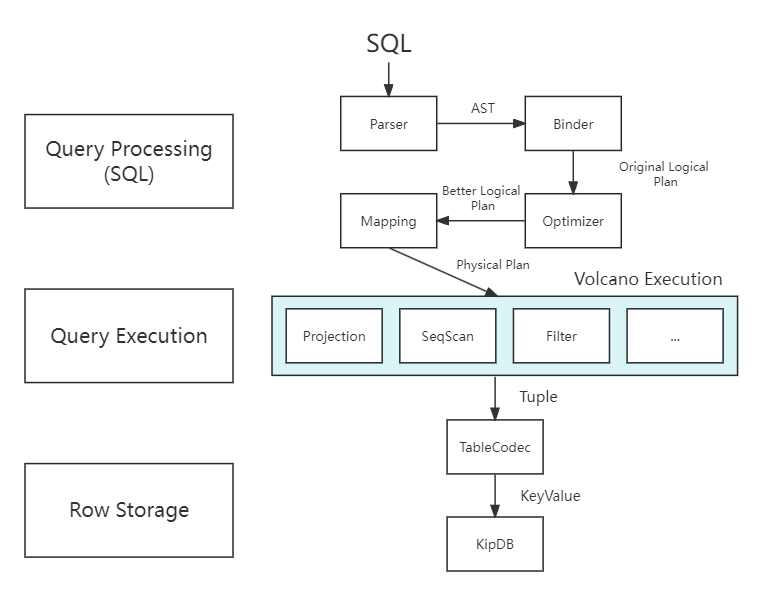
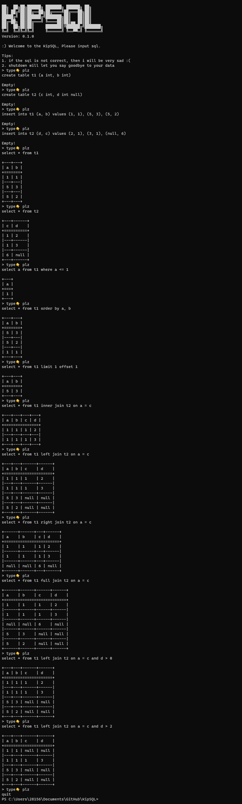

<pre align="center">
Built by @KipData

██╗  ██╗██╗██████╗ ███████╗ ██████╗ ██╗
██║ ██╔╝██║██╔══██╗██╔════╝██╔═══██╗██║
█████╔╝ ██║██████╔╝███████╗██║   ██║██║
██╔═██╗ ██║██╔═══╝ ╚════██║██║▄▄ ██║██║
     ██║  ██╗██║██║     ███████║╚██████╔╝███████╗
     ╚═╝  ╚═╝╚═╝╚═╝     ╚══════╝ ╚══▀▀═╝ ╚══════╝
-----------------------------------
Embedded SQL DBMS
</pre>
<br/>

### Architecture
Welcome to our WebSite, Power By KipSQL:
**http://www.kipdata.site/**

> Lightweight SQL calculation engine, as the SQL layer of KipDB, implemented with TalentPlan's TinySQL as the reference standard




### Get Started
``` toml
kip-sql = "0.0.1-alpha.0"
```

Install rust toolchain first.
```
cargo run
```
test command
```sql
create table t1 (a int primary key, b int);

insert into t1 (a, b) values (1, 1), (5, 3), (6, 2);

update t1 set a = 0 where b > 1;

delete from t1 where b > 1;

select * from t1;

select * from t1 order by a asc nulls first

select count(distinct a) from t1;

truncate table t1;

drop table t1;
```
Using KipSQL in code
```rust
let kipsql = Database::with_kipdb("./data").await?;

let tupes = db.run("select * from t1").await?;
```
Storage Support:
- KipDB
- Memory



### Features
- ORM Mapping
```rust
#[derive(Debug, Clone, Default)]
pub struct Post {
    pub post_title: String,
    pub post_date: NaiveDateTime,
    pub post_body: String,
}

implement_from_tuple!(Post, (
    post_title: String => |post: &mut Post, value: DataValue| {
        if let Some(title) = value.utf8() {
            post.post_title = title;
        }
    },
    post_date: NaiveDateTime => |post: &mut Post, value: DataValue| {
        if let Some(date_time) = value.datetime() {
            post.post_date = date_time;
        }
    },
    post_body: String => |post: &mut Post, value: DataValue| {
        if let Some(body) = value.utf8() {
            post.post_body = body;
        }
    }
));
```
- SQL field options
  - not null
  - null
  - unique
  - primary key
- SQL where options
  - is null
  - is not null
  - like
  - not like
- Supports index type
  - Unique Index
- Supports multiple primary key types
  - Tinyint
  - UTinyint
  - Smallint
  - USmallint
  - Integer
  - UInteger
  - Bigint
  - UBigint
  - Varchar
- DDL
  - Create
    - [x] Table
    - [ ] Index
  - Drop
    - [x] Table
    - [ ] Index
  - [x] Truncate
- DQL
  - [x] Select
    - SeqScan
    - IndexScan
  - [x] Where
  - [x] Distinct
  - [x] Alias
  - [x] Aggregation: count()/sum()/avg()/min()/max()
  - [ ] Subquery
  - [x] Join: Inner/Left/Right/Full Cross(x)
  - [x] Group By
  - [x] Having
  - [x] Order By
  - [x] Limit
- DML
  - [x] Insert
  - [x] Insert Overwrite
  - [x] Update
  - [x] Delete
- DataTypes
  - Invalid
  - SqlNull
  - Boolean
  - Tinyint
  - UTinyint
  - Smallint
  - USmallint
  - Integer
  - UInteger
  - Bigint
  - UBigint
  - Float
  - Double
  - Varchar
  - Date
  - DateTime
- Optimizer rules
  - Limit Project Transpose
  - Eliminate Limits
  - Push Limit Through Join
  - Push Limit Into Scan
  - Combine Filters
  - Column Pruning
  - Collapse Project

### Thanks For
- [Fedomn/sqlrs](https://github.com/Fedomn/sqlrs): 主要参考资料，Optimizer、Executor均参考自sqlrs的设计
- [systemxlabs/bustubx](https://github.com/systemxlabs/bustubx)
