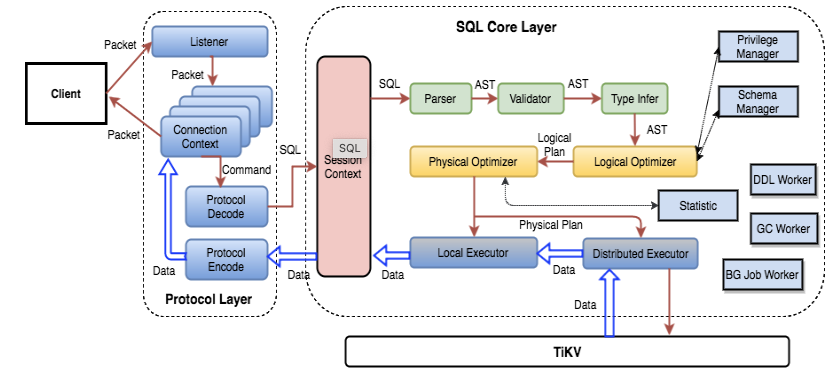

# KipSQL 

> build the SQL layer of KipDB database.
> 

# What SQL layer needs to do

- SQL API: User interface that receives requests from outside.
- Parser: Converts SQL text into an abstract syntax tree (AST).
    - Semantic analysis: Validates the legality of the AST tree.
- Optimizer:
    - Logical optimization: Converts the AST tree into an optimized logical query plan.
    - Physical optimization: Converts the logical query plan into a [physical query plan](https://www.zhihu.com/search?q=%E7%89%A9%E7%90%86%E6%9F%A5%E8%AF%A2%E8%AE%A1%E5%88%92&search_source=Entity&hybrid_search_source=Entity&hybrid_search_extra=%7B%22sourceType%22%3A%22article%22%2C%22sourceId%22%3A%22557876303%22%7D) for one or more nodes in the cluster to execute.
- Executor: Executes the physical plan by sending read and write requests (sent to the transaction layer) to the underlying kv storage.

You can refer to the TIDB flowchart, which is very clear.



# SQL Engine Design

### Expected Supported SQL Syntax Types

- Data Definition Language (DDL): Used to define, modify, and delete resources in the database, such as creating and deleting tables.
- Data Manipulation Language (DML): Used to change the data stored in the database, i.e., adding, modifying, and deleting data.
- Data Query Language (DQL): Also known as data retrieval language, used to retrieve data from tables and describe how to return data to program output.

### Parser

The logic for implementing the parser is quite complicated. In the initial stages of the project, you can use an existing library for parsing.

Parser selection

[https://github.com/sqlparser-rs/sqlparser-rs](https://github.com/sqlparser-rs/sqlparser-rs)

```rust
use sqlparser::dialect::GenericDialect;
use sqlparser::parser::Parser;

let sql = "SELECT a, b, 123, myfunc(b) \
           FROM table_1 \
           WHERE a > b AND b < 100 \
           ORDER BY a DESC, b";

let dialect = GenericDialect {}; // or AnsiDialect, or your own dialect ...

let ast = Parser::parse_sql(&dialect, sql).unwrap();

println!("AST: {:?}", ast);
```

However, the `sqlparser-rs` library can only provide lexical analysis and syntax analysis, generating the AST tree, but cannot perform semantic analysis, that is, validity verification. Therefore, we wrapped the sqlparser library to add semantic analysis capabilities.

## Semantic Analysis

- Timely error checking
    - Identifier resolve
        - Database, table, column, attribute existence and correctness verification
    - Semantic logic constraints
        - The relationship between group by and select items
        - The relationship between distinct and order, group by
        - Whether select items are in the source relation
        - ...
    - Correctness of SQL fragment expressions
        - Analyze the return type and correctness of each smallest expression respectively. For example, in where expr1 = subquery, it is required to verify that the results on both sides of "=" can be compared.
        - The correctness of these expression combinations, for example, expr1 and expr2 require that the return results of expr1/2 expressions must be boolean type to perform the AND operation.
        - ...
- Analyze the results, as optional parameters passed to the planner that generates the logical plan, and further converted and applied as parameters.
    - For example, functionExpression can be used to transform and generate specific function calls. This process requires knowledge of the parameter types, return types, etc. of func(A,B) C, in order to correspondingly call specific functions.

## Optimizer

### Overview of Optimizer


### The Core Objective of Query Optimizer is

- To quickly find a semantically equivalent and most efficient query execution plan within an acceptable time frame based on the plan generated from query.

### The three most important points to satisfy its objective at the core are as follows:

- Fast and acceptable time
- Semantic equivalence
- Most efficient query

Academia and industry are constantly working to achieve the goal of optimizing database query performance. The types of query optimizers that are frequently mentioned include CBO, RBO, and HBO.

HBO (Heuristic-Based Optimizer) and RBO (Rule-Based Optimizer) are early implementations of database query optimizers. However, their limitations make them unable to meet the needs of today's complex database systems. Therefore, CBO (Cost-Based Optimizer) needs to be introduced.

HBO uses heuristic algorithms to choose the optimal query execution plan. It regards the query optimization process as a search problem and tries to guide the search using some empirical rules. However, these heuristic rules may not be applicable in all cases, resulting in HBO being unable to find the optimal query execution plan.

RBO is another optimizer that uses a series of rules to guide the query optimization process. These rules are usually based on query syntax and data schema and do not consider factors such as query complexity and data distribution. Therefore, RBO is usually only applicable to simple queries and cannot find the optimal execution plan for complex queries.

CBO introduces the concept of a cost model, which selects the optimal query execution plan based on query cost. The cost model is based on statistical information and database structure and considers factors such as query complexity and data distribution. CBO uses the cost model to evaluate the cost of each possible query execution plan and selects the execution plan with the minimum cost as the final execution plan. Therefore, CBO can handle more complex queries and find the optimal query execution plan.

The core of CBO is based on cost, and if the cost cannot be estimated correctly, the entire optimization result is wrong. The process of estimating the cost is also a complex process, and it has been proven to be an NP-Hard problem to quickly select the optimal solution from all plan trees in a limited time. This has led to CBO never having a perfect, comprehensive, and accurate solution.

For CBO, there are three core components that the industry abstracts, as shown in the figure below, and this is the subdivision that the industry and academia have focused on in recent years.

- **Cardinality Estimation**
- **Cost Model**
- **Plan Enumeration**


**As shown in the figure above, the first step of the query optimizer is to perform cardinality estimation and cost modeling.**

- Cardinality refers to the scale of data operated by an operator. For example, for an operator like TableScan, its cardinality is the amount of data in the table, and for an operator like hashjoin, it is the number of specific data NDVs. If the cardinality is incorrect, the estimated cost will be wrong, resulting in an incorrect cost evaluation. For example, broadcasting the large table to each node, and partitioning the small table to perform the join without distinguishing between large and small tables.
- The cost model refers to the calculation cost formula of various operators in various data, such as how much time it takes for a TableScan to process one row, how much time it takes for a filter to process one row, and whether there are some influencing factor coefficients, etc. Different cost formulas will yield different cost results, resulting in different execution plans being selected.

**The next step is plan enumeration, the purpose of which is to quickly select the plan with the smallest cost among many plans.**

- Since the process of enumerating plans expands exponentially as the number of join tables increases, it is unrealistic to list all plans and select the optimal plan.
- The industry usually uses bottom-up dynamic programming methods [System R], top-down memorization methods [volcano&cascade series], and random join order methods [before PG 11] to handle this.
- From a historical development point of view,
    - Random joins are definitely a probability problem, and later evolution space is not large;
    - The bottom-up architecture involves scalability and various iterative development issues, resulting in slow development;
    - Top-down is currently recognized, and the typical volcano optimizer has the early Apache Calcite
    - The early MS SQL Server and Columbia in the cascade series were later merged into PostgreSQL. The newer open-source implementation is ORCA, which is relatively simple. Alibaba Cloud ADB also uses the cascade architecture.

**Regarding these three core components, combined with some published academic dynamics, the future development directions may be as follows:**

- Cardinality Estimation
    - Learning-based methods, which have been widely studied in the past two years.
    - Hybrid methods, which combine multiple methods to complement each other.
    - Experimental studies, which validate the effectiveness and accuracy of these methods through more experiments; otherwise, many studies are still in the academic stage.
- Cost Model
    - Cloud database systems, which combine cost estimation in cloud environments, such as computing time in multi-cloud, cloud environment payment costs, etc.
    - Learning-based methods, which estimate costs based on some machine learning methods, such as training a large number of operators to obtain various input situations and operator cost situations, so as to estimate the total cost of all operators of a new query plan.
- Plan Enumeration
    - Handling Large queries, which requires in-depth research on how to handle them.
    - Learning-based methods, which continue to study machine learning methods. Currently, this method is not widely commercialized, and non-machine learning solutions are still mainstream.


## Executor

The execution engine in Elasticsearch adopts the Volcano model.

The optimizer generates a physical query plan tree which is then converted into an executor tree. Each node in the tree implements the executor interface, and data is passed between executors through the Next interface. For example, for the query "`select c1 from t where c2 > 1;`", the generated executors are Projection->Filter->TableScan. The top-level Projection continuously calls the Next interface of the underlying executors, and finally calls the bottom-level TableScan to obtain data from the table.


> **Velox** can be considered in the future.
> 
> 
> **Velox** accepts an optimized `PlanNode` Tree and then cuts it into linear `Pipeline`. `Task` is responsible for this transformation process, and each Task corresponds to a PlanTree Segment. Most operators are one-to-one translations, but there are some special operators that usually appear at the junctions of multiple Pipelines, which correspond to the forks of the plan tree, such as `HashJoinNode`, `CrossJoinNode`, and `MergeJoinNode`, which are usually translated into XXProbe and XXBuild. However, there are also some exceptions, such as `LocalPartitionNode` and `LocalMergeNode`.
> 
> ### The Necessity of **Velox**
> 
> The main differences between different data processing systems are:
> 
> - Language front-end level: SQL, dataframe, and other DSLs, etc.
> - Optimizer
> - Task partitioning: how to partition data/tasks in a distributed scenario
> - IO layer
> 
> However, their execution layers are very similar:
> 
> - Type system
> - Data representation/layout in memory
> - Expression evaluation system
> - Storage layer, network serialization
> - Encoding
> - Resource management primitives
> 
> **Velox** aims to be a general execution layer: it accepts a query plan optimized by the optimizer and executes the query plan using local resources. However, it does not perform SQL parser or optimizer functions.
> 

🪜We are currently building a Push-Based Execution vector execution model similar to DUCKDB, and it is under intense construction.


## Future Research

Processing a table to key-value mapping relationship.

In the initial stage, a simple optimizer can be implemented.

Can **Velox** access KipDB as a storage engine?

# Reference

[TiDB 源码阅读系列文章（五）TiDB SQL Parser 的实现](https://cn.pingcap.com/blog/tidb-source-code-reading-5)

[Facebook Velox 运行机制全面剖析](https://zhuanlan.zhihu.com/p/614918289)

[Velox: Meta’s Unified Execution Engine](https://zhuanlan.zhihu.com/p/620275762)

[TinySQL 实现总结](https://waruto.top/posts/tinysql-impl/)

[揭秘 TiDB 新优化器：Cascades Planner 原理解析](https://zhuanlan.zhihu.com/p/94079481)

[TiDB 源码初探](https://zhuanlan.zhihu.com/p/24564238)

[Push-Based Execution in DuckDB - Mark Raasveldt](https://www.youtube.com/watch?v=MA0OsvYFGrc)

[Push-Based Execution in DuckDB](https://dsdsd.da.cwi.nl/slides/dsdsd-duckdb-push-based-execution.pdf)

[Paper Reading: MonetDB/X100: Hyper-Pipelining Query Execution](https://frankma.me/posts/papers/monetdb-hyper-pipelining-query-execution/)

[查询执行 | Databend 内幕大揭秘](https://psiace.github.io/databend-internals/docs/the-basics/executor-in-query-process/)

[[转][不会游泳的鱼]SQL引擎发表、落地论文总结](https://distsys.cn/d/179-zhuan-bu-hui-you-yong-de-yu-sqlyin-qing-fa-biao-luo-di-lun-wen-zong-jie)

[Apache Arrow：一种适合异构大数据系统的内存列存数据格式标准](https://tech.ipalfish.com/blog/2020/12/08/apache_arrow_summary/)

[TPC-H benchmark of Hyper and DuckDB on Windows and Linux OS - Architecture et Performance](https://www.architecture-performance.fr/ap_blog/tpc-h-benchmark-of-hyper-and-duckdb-on-windows-and-linux-os/)