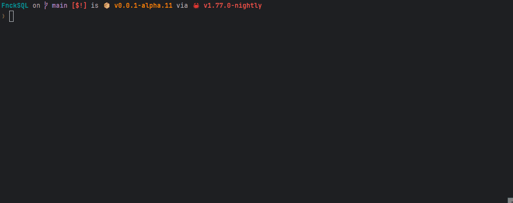
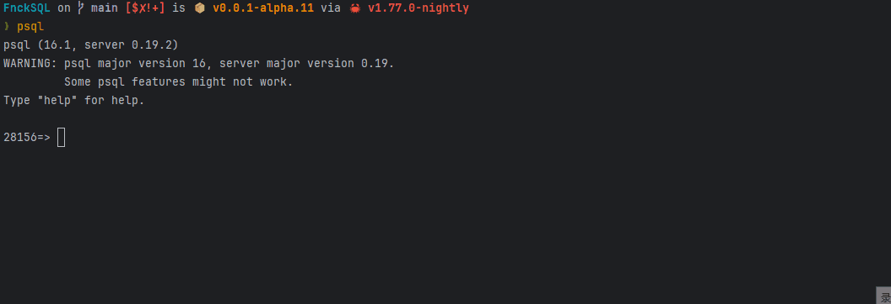

<pre align="center">
Built by @KipData


███████╗███╗   ██╗ ██████╗██╗  ██╗    ███████╗ ██████╗ ██╗     
██╔════╝████╗  ██║██╔════╝██║ ██╔╝    ██╔════╝██╔═══██╗██║     
█████╗  ██╔██╗ ██║██║     █████╔╝     ███████╗██║   ██║██║     
██╔══╝  ██║╚██╗██║██║     ██╔═██╗     ╚════██║██║▄▄ ██║██║     
██║     ██║ ╚████║╚██████╗██║  ██╗    ███████║╚██████╔╝███████╗
╚═╝     ╚═╝  ╚═══╝ ╚═════╝╚═╝  ╚═╝    ╚══════╝ ╚══▀▀═╝ ╚══════╝

-----------------------------------
🖕
</pre>
<h3 align="center">
    Lightweight DBMS
</h3>

<p align="center">
    <a href="https://summer-ospp.ac.cn/org/orgdetail/0b09d23d-2510-4537-aa9d-45158bb6bdc2"></a>
    <a href="https://github.com/KipData/KipSQL/blob/main/LICENSE"></a>
    &nbsp;
    <a href="https://www.rust-lang.org/community"></a>
</p>
<p align="center">
    <a href="https://github.com/KipData/KipSQL/actions/workflows/ci.yml"></img></a>
    <a href="https://crates.io/crates/fnck_sql/"></a>
    <a href="https://hub.docker.com/r/kould23333/fncksql"></a>
</p>
<p align="center">
  <a href="https://github.com/KipData/KipSQL" target="_blank">
    
    
  </a>
</p>

### What is FnckSQL

FnckSQL is a high-performance SQL database
that can be embedded in Rust code (based on RocksDB by default),
making it possible to call SQL just like calling a function.
It supports most of the syntax of SQL 2016. 

### Quick Started
Tips: Install rust toolchain and llvm first.

Clone the repository
``` shell
git clone https://github.com/KipData/FnckSQL.git
```
#### Using FnckSQL in code
```rust
let fnck_sql = DataBaseBuilder::path("./data").build()?;
let tuples = fnck_sql.run("select * from t1")?;
```

### TPCC
run `cargo run -p tpcc --release` to run tpcc

- i9-13900HX
- 32.0 GB
- YMTC PC411-1024GB-B
- Tips: TPCC currently only supports single thread
```shell
<90th Percentile RT (MaxRT)>
   New-Order : 0.005  (0.007)
     Payment : 0.084  (0.141)
Order-Status : 0.492  (0.575)
    Delivery : 6.109  (6.473)
 Stock-Level : 0.001  (0.001)
<TpmC>
98 Tpmc
```
#### PG Wire Service
run `cargo run --features="net"` to start server

then use `psql` to enter sql


Storage Support:
- RocksDB

### Docker
#### Pull Image
```shell
docker pull kould23333/fncksql:latest
```
#### Build From Source
~~~shell
git clone https://github.com/KipData/FnckSQL.git
cd FnckSQL
docker build -t kould23333/fncksql:latest .
~~~

#### Run
We installed the `psql` tool in the image for easy debug.

You can use `psql -h 127.0.0.1 -p 5432` to do this.

~~~shell
docker run -d \
--name=fncksql \
-p 5432:5432 \
--restart=always \
-v fncksql-data:/fnck_sql/fncksql_data \
-v /etc/localtime:/etc/localtime:ro \
kould23333/fncksql:latest
~~~

### Features
- ORM Mapping: `features = ["macros"]`
```rust
#[derive(Default, Debug, PartialEq)]
struct MyStruct {
  c1: i32,
  c2: String,
}

implement_from_tuple!(
    MyStruct, (
        c1: i32 => |inner: &mut MyStruct, value| {
            if let DataValue::Int32(Some(val)) = value {
                inner.c1 = val;
            }
        },
        c2: String => |inner: &mut MyStruct, value| {
            if let DataValue::Utf8(Some(val)) = value {
                inner.c2 = val;
            }
        }
    )
);
```
- User-Defined Function: `features = ["macros"]`
```rust
scala_function!(TestFunction::test(LogicalType::Integer, LogicalType::Integer) -> LogicalType::Integer => |v1: DataValue, v2: DataValue| {
    let plus_binary_evaluator = EvaluatorFactory::binary_create(LogicalType::Integer, BinaryOperator::Plus)?;
    let value = plus_binary_evaluator.binary_eval(&v1, &v2);

    let plus_unary_evaluator = EvaluatorFactory::unary_create(LogicalType::Integer, UnaryOperator::Minus)?;
    Ok(plus_unary_evaluator.unary_eval(&value))
});

let fnck_sql = DataBaseBuilder::path("./data")
    .register_scala_function(TestFunction::new())
    .build()?;
```
- User-Defined Table Function: `features = ["macros"]`
```rust
table_function!(MyTableFunction::test_numbers(LogicalType::Integer) -> [c1: LogicalType::Integer, c2: LogicalType::Integer] => (|v1: DataValue| {
    let num = v1.i32().unwrap();

    Ok(Box::new((0..num)
        .into_iter()
        .map(|i| Ok(Tuple {
            id: None,
            values: vec![
                DataValue::Int32(Some(i)),
                DataValue::Int32(Some(i)),
            ]
        }))) as Box<dyn Iterator<Item = Result<Tuple, DatabaseError>>>)
}));
let fnck_sql = DataBaseBuilder::path("./data")
  .register_table_function(MyTableFunction::new())
  .build()?;
```
- Optimizer
  - RBO
  - CBO based on RBO(Physical Selection)
- Execute
  - Volcano
- MVCC Transaction
  - Optimistic
- Field options
  - [not] null
  - unique
  - primary key
- SQL where options
  - is [not] null
  - [not] like
  - [not] in
- Supports index type
  - PrimaryKey
  - Unique
  - Normal
  - Composite
- Supports multiple primary key types
  - Tinyint
  - UTinyint
  - Smallint
  - USmallint
  - Integer
  - UInteger
  - Bigint
  - UBigint
  - Char
  - Varchar
- DDL
  - Begin (Server only)
  - Commit (Server only)
  - Rollback (Server only)
  - Create
    - [x] Table
    - [x] Index: Unique\Normal\Composite
    - [x] View
  - Drop
    - [x] Table
    - [ ] Index
    - [x] View
  - Alert
    - [x] Add Column
    - [x] Drop Column
  - [x] Truncate
- DQL
  - [x] Select
    - SeqScan
    - IndexScan
  - [x] Where
  - [x] Distinct
  - [x] Alias
  - [x] Aggregation: count()/sum()/avg()/min()/max()
  - [x] SubQuery[select/from/where]
  - [x] Join: Inner/Left/Right/Full/Cross (Natural\Using)
  - [x] Group By
  - [x] Having
  - [x] Order By
  - [x] Limit
  - [x] Show Tables
  - [x] Explain
  - [x] Describe
  - [x] Union
- DML
  - [x] Insert
  - [x] Insert Overwrite
  - [x] Update
  - [x] Delete
  - [x] Analyze
  - [x] Copy To 
  - [x] Copy From
- DataTypes
  - Invalid
  - SqlNull
  - Boolean
  - Tinyint
  - UTinyint
  - Smallint
  - USmallint
  - Integer
  - UInteger
  - Bigint
  - UBigint
  - Float
  - Double
  - Char
  - Varchar
  - Date
  - DateTime
  - Time
  - Tuple

## Roadmap
- SQL 2016

## License

FnckSQL uses the [Apache 2.0 license][1] to strike a balance between
open contributions and allowing you to use the software however you want.

[1]: <https://github.com/KipData/KipSQL/blob/main/LICENSE>

## Contributors
[](https://github.com/KipData/FnckSQL/graphs/contributors)

## Thanks For
- [Fedomn/sqlrs](https://github.com/Fedomn/sqlrs): Main reference materials, Optimizer and Executor all refer to the design of sqlrs
- [systemxlabs/bustubx](https://github.com/systemxlabs/bustubx)
- [duckdb/duckdb](https://github.com/duckdb/duckdb)
